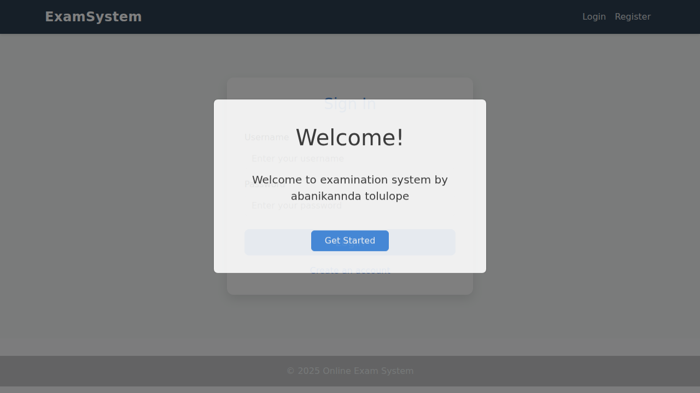
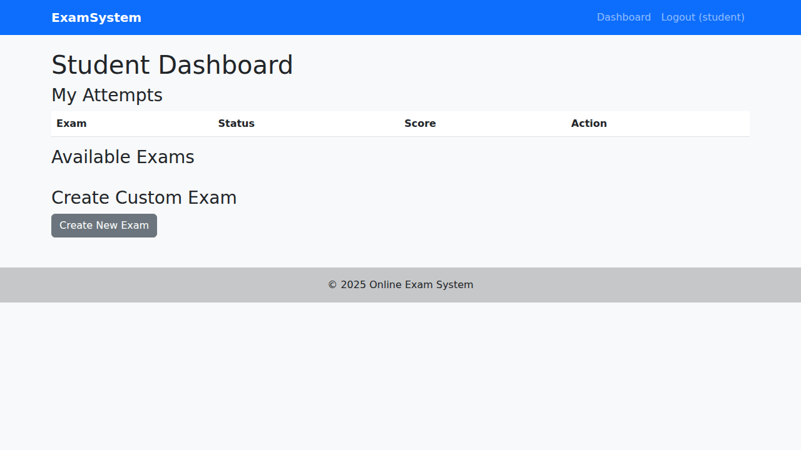
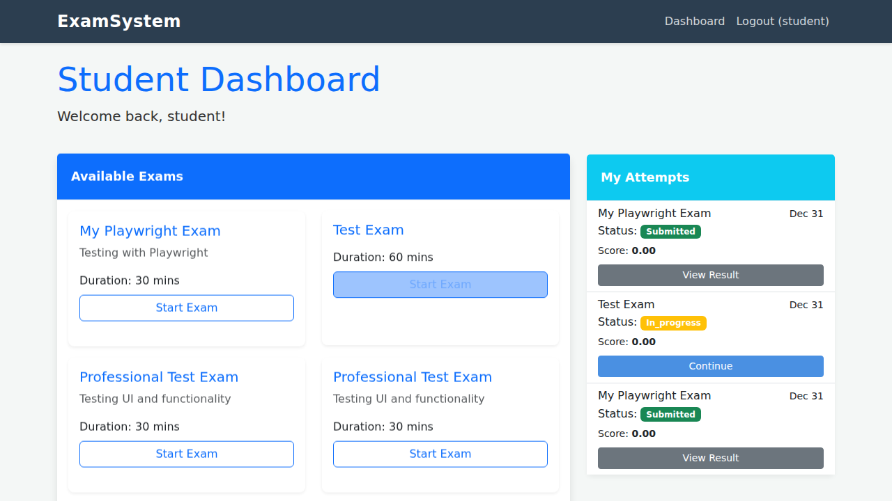
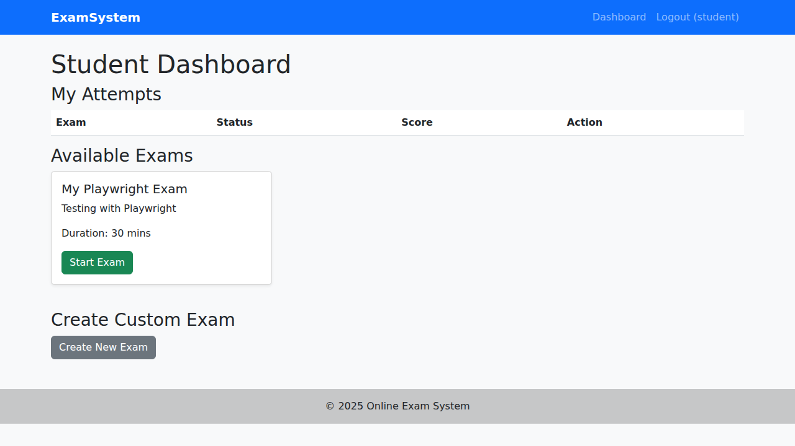
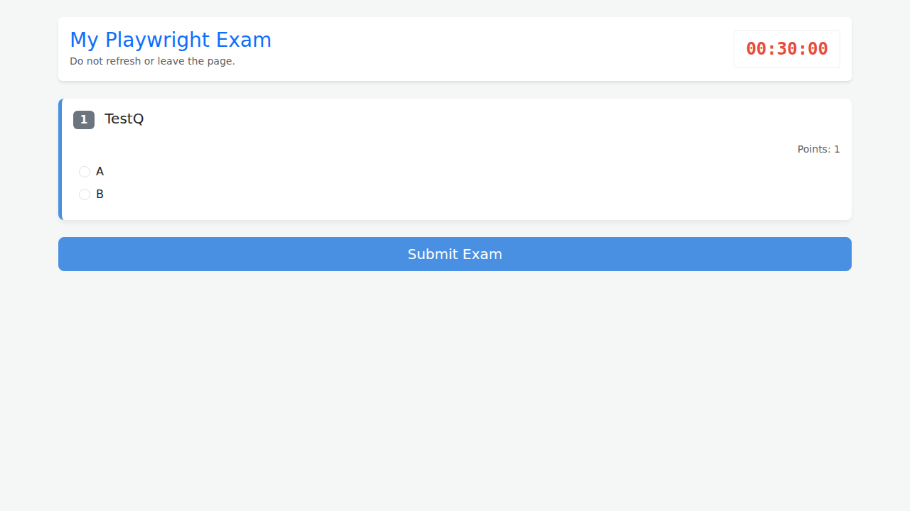
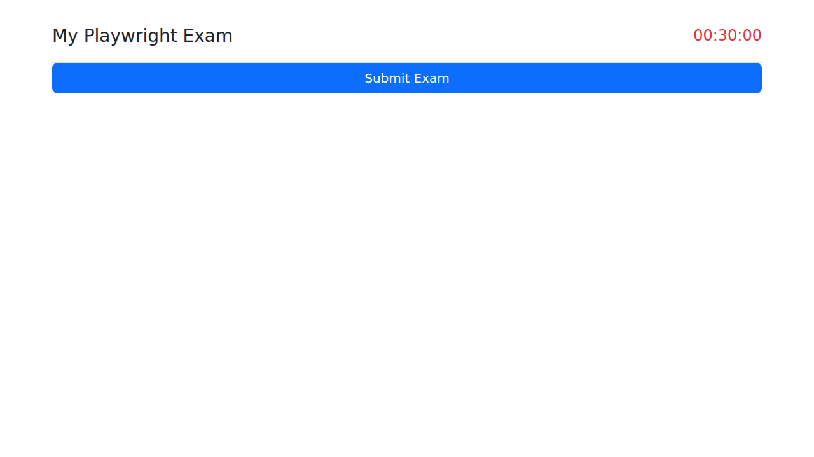
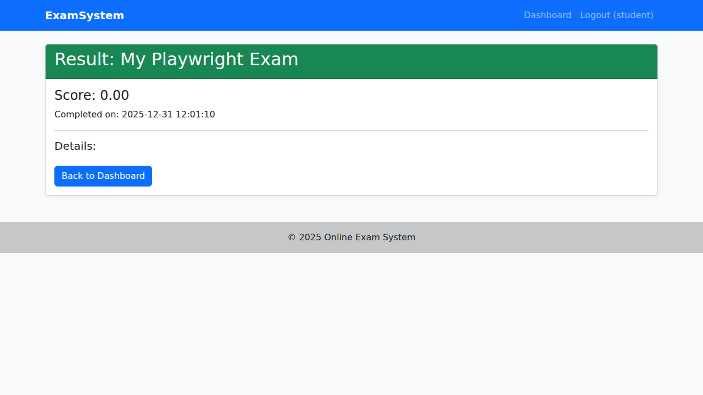
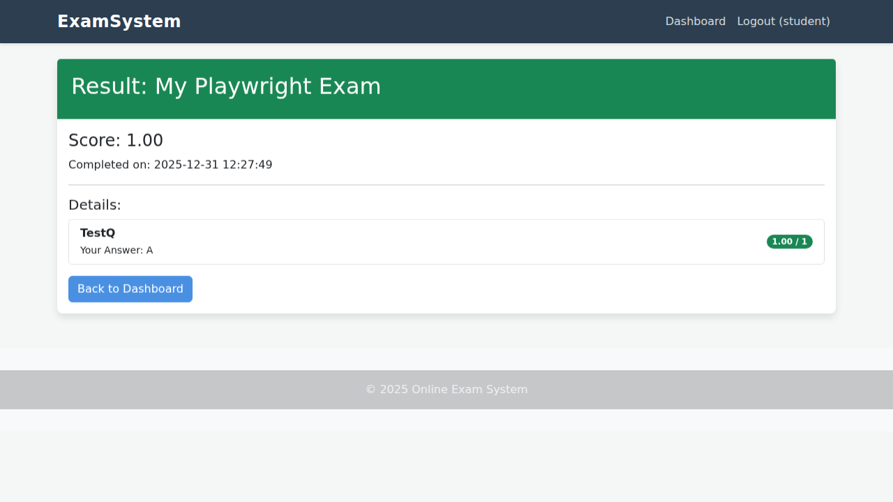

# Online Examination System

## Setup Instructions

1.  **Environment**: Requires PHP 8.x and MySQL 8.x.
2.  **Database**:
    *   Create a database named `online_exam`.
    *   Import the schema from `database.sql` (e.g., `mysql -u root -p online_exam < database.sql`).
    *   Update database credentials in `config/db.php`.
3.  **Run Server**:
    *   `php -S localhost:8000` from the project root.
4.  **Access**:
    *   Open `http://localhost:8000`.

## Login Credentials

*   **Admin**:
    *   Username: `admin`
    *   Password: `admin123`
*   **Student**:
    *   Username: `student`
    *   Password: `student123`

## Technology Stack

*   **Frontend**: HTML, CSS, Bootstrap 5, jQuery
*   **Backend**: PHP (Vanilla)
*   **Database**: MySQL

## Features Completed

*   **Admin**:
    *   Create/Edit/Delete Exams.
    *   Add 5 types of questions (Single Choice, Multiple Choice, True/False, Short Answer, Fill in Blank).
    *   Manage Questions.
    *   View Student List.
*   **Student**:
    *   Register/Login.
    *   Dashboard with Available Exams.
    *   Create Custom Practice Exam (with editable title).
    *   Take Exam with Timer.
    *   Auto-submit on timeout.
    *   Tab Switch Detection (Anti-cheating).
    *   View Results with Score and Breakdown.
*   **Security**:
    *   Password Hashing (BCrypt).
    *   Session-based Authentication.
    *   Role-based Access Control.
    *   Prepared Statements (SQL Injection prevention).
    *   Context Menu disabled on Exam page.

## Project Structure

*   `admin/` - Admin functionality scripts.
*   `student/` - Student functionality scripts.
*   `auth/` - Authentication scripts.
*   `config/` - Configuration (DB).
*   `includes/` - Header/Footer.
*   `public/` - Static assets.

## Screenshots

### Authentication & Dashboard

### Exam Interface

### Results

## Made with love by Abanikannda Tolulope

